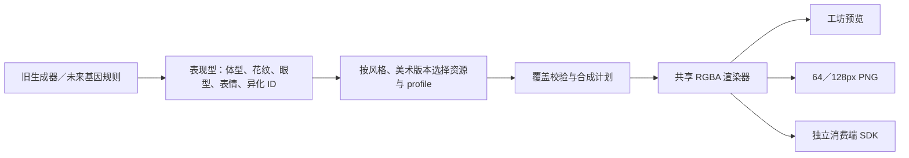

# 像素美术包接入契约 v1 / v2

## 本轮交付

毛绒版维持现有规模；后续新增美术以像素版为主。QMonsterCreator 已提供独立表现型、像素目录、可移植渲染 SDK、工坊预览和透明 PNG／形象 JSON 导出。Nutri 正式运行时尚未接入。

| 包 | 美术版本 | 覆盖组合 | 可用于生成 | PNG 图层 | 使用范围 |
|---|---|---:|---:|---:|---|
| v2-approved-1.2.1 | 1.2.1 | 32 | 32 | 15 | 当前已验收包；标准圆眼小尖牙 16 种部件组合全部批准 |
| v2-coverage-standard-small-fangs-round | 1.2.1-candidate.1 | 32 | 21 | 15 | 保留晋升前快照；新增 11 个在该历史身份中仍为 pending |
| v2-approved | 1.2.0 | 21 | 21 | 15 | 历史已验收包；原七个待验收组合已于 2026-09-17 批准 |
| v2-candidate | 1.2.0-candidate.1 | 21 | 14 | 15 | 14 个 v1 已验收组合迁移为圆眼；7 个体型／眼型组合保留当时 pending 状态 |
| approved | 1.1.0 | 14 | 14 | 8 | 历史已验收包：首批 4 个与第二阶段 10 个组合 |
| legacy-approved | 1.0.0 | 4 | 4 | 3 | 保留首批版本，供旧存档回放 |
| candidate | 1.1.0-candidate.1 | 14 | 4 | 8 | 保留验收前快照及其原有验收状态，供旧存档回放 |

用户明确回复“验收通过”，第二阶段 10 个组合已全部通过，记录见 `docs/qa/flat-source-trial/stage2/approval.json`。当时 14 个组合全部进入生成白名单。覆盖集合是明确列出的组合，不是把资源数相乘后的理论组合数；未覆盖组合仍报错。验收仅提升状态及生成范围，图片、profile 和 RGBA 结果保持不变。历史候选包保留原始字节，该段记录 1.1.0 的历史验收；当前版本为下述 1.2.0。

v2 候选目录为 `pixel-art-catalog-v2`，revision 为 `3ba990a5dfde65b0b79dabe958c9d3c742a08a30fdb582536b85cde5b11c288d`。其中 14 个迁移条目保持 v1.1.0 的 RGBA 摘要并可生成；7 个新条目仍为 `review: pending`，不在 `generatable`。`1.2.0-candidate.1` 保留原审阅快照。2026-09-17 用户明确回复 `ok，通过`，已另行产出 `1.2.0`，revision 为 `5b3a92c67957fda3bfe12f6f598e631e1942cc3303d07775fee4bc33aea3bd36`。审批记录 `docs/qa/flat-source-trial/stage3/approval.json` 精确绑定七个样本及全部来源证据；1.2.0 的 21 个 coverage 均 approved 且进入 generatable，profile、资源、renderer 与所有 RGBA 摘要不变。

随后 `standard-small-fangs-round` 补齐 11 个既有部件组合；用户在 16 格 QA 后明确回复 `通过`。正式 `1.2.1` revision 为 `95220d4070b420de70534b77b792fc5cafed3be0f931ef71c09a552576daaae0`，32 个 coverage 全部 approved／generatable，0 pending。审批记录 `docs/qa/pixel-standard-small-fangs-approved/approval.json` 只绑定这 11 个新增条目及候选、QA、来源摘要；候选 `1.2.1-candidate.1` 保留原字节和 pending 状态。

## 分层与数据流



- `feline-phenotype-v1` 只含语义 ID。无图片路径、图层坐标、随机种子、基因或美术版本。
- `phenotypeFromLegacy(save)` 校验旧规格后复制已解析的 selections，并补 `body: standard`。不重跑 RNG，不修改旧保存数据。旧 rolls、locks、seed 继续由旧规格持有；导出的像素形象不是可逆的完整旧生成器存档。
- `pixel-art-catalog-v1` 管理美术资源。profile 由 body、coat、expression 选中，steps 声明部件顺序、前后层、替换清除区和部件自身的遮挡区。
- `feline-phenotype-v2` 将 `eyes` 作为必填语义字段；固定字段顺序为 `body, coat, eyes, expression, crown, ears, neck, back, tailTip`。眼型与嘴部表情相互独立，表现型仍不保存图片路径、坐标、遮罩、种子或美术版本。
- `phenotypeV2FromV1` 对已经解析的 v1 表现型确定性补 `eyes: round`，其余八个字段原样复制，不重新运行随机生成器。v1 key、目录、存档和 revision 继续由 v1 API 回放；迁移结果是新的 v2 表现型，不能冒充原 v1 存档。
- `pixel-art-catalog-v2` 的 profile 由 `body + coat + eyes + expression` 四项唯一选择。当前眼型烘焙在完整主体 PNG 中；运行时没有擦旧眼或叠眼睛贴片。
- PNG 已经像素化并定位到统一 64×64 画布。源图的缩放／平移在生产步骤烘焙；运行时使用 64px 坐标的多边形，避免消费端重复套用源图几何。
- `coverage` 表达可渲染且有回放证据的确切组合；`review` 表达美术验收状态；`generatable` 是独立白名单，并要求所有成员已验收。生成器应读取该白名单，不从候选覆盖集合随机抽取。
- 本轮没有加入育种算法、新随机权重或 Nutri 成长规则。

## 版本与回放

形象存档分别为 `feline-appearance-v1` 和 `feline-appearance-v2`，均包含对应版本的 `phenotype` 与 `art: {styleId, artVersion, revision}`。revision 为去除 revision 字段后的目录规范 JSON 的 SHA-256，覆盖 profile、图层摘要、覆盖集合、验收状态和生成白名单。v1 与 v2 解析器严格区分 schema；缺少 `eyes` 的 v1 数据不能直接按 v2 解析。

`restorePixelAppearance` / `restorePixelAppearanceV2` 必须匹配完整美术标识；不自动迁移或忽略 revision。`pixelArtKeyV2` 包含风格、版本、revision 和九个表现型字段，供消费端缓存使用。发布新包后应保留旧包以支持旧形象回放。v2 仍返回既有 `PixelArtPlan`，`rendererVersion: pixel-rgba-v1` 与合成顺序、clear、occlusion、描边及透明语义均未改变；改变算法需新渲染版本及回放验证。

`resolvePixelArtV2` 只接受目录 `coverage` 中的完整九字段组合。眼型、体型或异化组合未登记时会明确抛出 `Unsupported pixel combination`，不会借用其他眼型主体、推导自由组合或混用毛绒资源。`generatablePixelPhenotypesV2` 只返回已批准白名单；pending 条目仅供候选审阅和确定性回放。

## 构建与运行

```powershell
npm run build:pixel
npm run build
npm run verify:pixel
npm run dev
```

工坊和当前独立消费页 `approved-1.2.1.html` 对新用户默认选择 1.2.1。历史 `index.html` 保留原字节和 1.2.0 默认值，不包含 1.2.1 选项。已有 v1／v2-candidate／v2 1.2.0 形象按完整 art identity 恢复，候选存档不会自动升级。

工坊入口：`http://127.0.0.1:4184/pixel`。旧毛绒入口仍为 `/`，浏览器保存键分别管理。

`dist/pixel-art/` 可以整体复制到一个静态站点：

```text
qmonster-pixel.js         独立浏览器 ESM SDK
index.html               历史消费端示例，默认 1.2.0
approved-1.2.1.html      当前正式 1.2.1 的独立消费端示例
v2-approved-1.2.1/catalog.json 当前已验收包 1.2.1
v2-approved-1.2.1/provenance.json 独立晋升 provenance，固定本批 approval.json
v2-approved-1.2.1/assets/ 15 张去重 PNG
v2-approved/catalog.json 历史已验收包 1.2.0
v2-approved/provenance.json 历史 1.2.0 晋升 provenance
v2-approved/assets/      15 张去重 PNG
approved/catalog.json    历史已验收包 1.1.0
approved/assets/         8 张 PNG
legacy-approved/catalog.json  首批 1.0.0
legacy-approved/assets/  3 张 PNG
candidate/catalog.json   历史候选快照
candidate/assets/        8 张 PNG
v2-candidate/catalog.json 体型／眼型候选包 1.2.0-candidate.1
v2-candidate/assets/     15 张去重 PNG
provenance.json           源图、验证记录和上游代码摘要
```

通过 HTTP 服务访问 `approved-1.2.1.html` 使用当前正式包；历史回放可访问 `index.html`。不要使用 file://。SDK 无 Nutri 仓库、本地绝对路径或 QMonsterCreator 源码依赖。构建依赖当前项目已有的 Node 工具链、已记录的源图和 QA 产物，不需要 Nutri checkout。

## Nutri 接入样例

```js
import {
  loadPixelArt, pixelCanvas, savePixelAppearance,
  restorePixelAppearance, generatablePixelPhenotypes, pixelArtKey,
} from './qmonster-pixel.js'

const base = new URL('./approved/', import.meta.url)
const response = await fetch(new URL('catalog.json', base))
if (!response.ok) throw new Error(`HTTP ${response.status}`)
const art = await loadPixelArt(await response.json(), r => new URL(r.path, base).href)

// 示例取第一个已验收候选。实际抽取／成长逻辑由消费端决定。
const phenotype = generatablePixelPhenotypes(art.catalog)[0]
const saved = savePixelAppearance(phenotype, art.catalog)
const restored = restorePixelAppearance(saved, art.catalog)
const rgba = art.render(restored)
document.body.append(pixelCanvas(rgba, 2))
const cacheKey = pixelArtKey(restored, art.catalog)
```

`loadPixelArt` 校验目录 revision、PNG 字节摘要、解码尺寸和二值 alpha，失败则拒绝载入。`art.render` 使用其内部已验证的目录和像素，返回新数组，不修改原图层。

v2 消费端使用 `loadPixelArtV2`、`savePixelAppearanceV2`、`restorePixelAppearanceV2`、`generatablePixelPhenotypesV2` 和 `pixelArtKeyV2`。浏览器示例会按目录 schema 分派 v1 / v2 API，不能把两代类型互相强转。

Node 或已有纹理解码器可使用底层 `resolvePixelArt`、`composePixelArt`；调用方应先校验目录和资源，不能将不受信任的 JSON 当作合成计划直接传入。

后续 Nutri 正式接入需处理：

1. 增加 body 与美术版本存储，确定旧用户何时切换版本。
2. 让生成／成长规则受 `generatable` 和现有性状兼容关系约束。
3. 用目录 profile 替代全局 CLEAR_POLYGONS 和固定 neck 层级。
4. 使用完整像素缓存键，并保留旧版资源包。

## 美术生产与扩展

1. 生成少量平涂源图；以 1254×1254 的统一坐标记录 body 和部件定位。新图需要单独美术检查。
2. 目前像素化参数沿用已验证的 Nutri 提交 `b7addf5914c18d8904103ba87576b196f3f75d9b`：`scripts/review-pixel-consumer.mjs` 和 `scripts/review-pixel-stage2.mjs` 可在配置 `NUTRI_DIR` 后重跑源图转换。该离线转换仍依赖 Nutri 参考脚本；发布包与消费端不依赖它。
3. `scripts/build-pixel-art.mjs` 从校验过的 QA 图层制作发布清单，去重内容相同的图层，并将已验证的遮罩／层级编入 profile。它是打包器，不重新生成美术或自动批准组合。
4. 增加 profile 与明确的组合覆盖，记录 RGBA 回放摘要，先进入候选包。几何和像素渲染语义不由消费端硬编码。
5. 小范围美术验收后，在新美术版本中增加批准记录和生成白名单。保留旧版本；不升级旧生成器的 catalogVersion 来触发重抽。

## 验证证据

- `docs/qa/pixel-production/report.json`：14 个浏览器回放、3 次真实 PNG 下载、JSON 恢复、旧规格导入、版本拒绝、缺失覆盖拒绝、损坏 PNG 拒绝、旧毛绒入口和异路径消费端验证。
- `packages/renderer-canvas/src/pixel-art-render.test.ts`：与先前独立验收报告中的 14 个 RGBA 摘要逐一比对，检查输入图层不被修改。
- `packages/asset-catalog/pixel/v1/provenance.json`：源图／QA 文件摘要与 Nutri 上游代码版本。
- 验收后增加提升范围与历史目录兼容测试，共 110 项单元测试；浏览器报告另记录历史候选 JSON 的回放检查。
- `docs/qa/flat-source-trial/stage3/report.json`：3 套体型几何、7 个 pending 候选、2 个圆眼对照、clear／occlusion 检查、14 个 v1 RGBA 回放及输入不变证据。
- `docs/qa/pixel-body-eye-batch/report.json`：浏览器真实画布回放 approved v2 21/21、candidate v2 21/21、v1 32/32；8 个失败导入保持原画面；23 个异路径消费端样本（approved 21、candidate 1、v1 1）；两种 v2 身份独立保存／恢复。
- `packages/asset-catalog/pixel/v2/provenance.json`：候选目录的源文件固定摘要、生产脚本和 Nutri 上游版本。

- `docs/qa/flat-source-trial/stage3/reproducibility-approved.json`：两次构建全部输出字节相同，历史 candidate 原字节不变；命令 `node scripts/verify-pixel-art-v2-reproducibility.mjs`。
- `packages/asset-catalog/pixel/v2/provenance.approved.json`：独立批准证据；原 `provenance.json` 始终保留候选身份。

当前只包含橘白花纹和明确列出的 32 个已验收组合，Nutri 运行时继续关闭。其他花纹、更多眼型、profile 完备性、aura 和运行时换色属于后续独立设计，不从本次批准推导自由组合。

## 标准圆眼小尖牙覆盖候选 1.2.1-candidate.1

本批只扩展 `standard-small-fangs-round` 的确切 coverage；龙角、鳍耳、小狮鬃、焰尾沿用现有图层与 profile。原 21 个条目的顺序、字段、approved 状态和生成白名单完整保留，新 11 个只用于审阅，不能进入生成。未列出的其他 profile 组合仍报错。

- 目录：`packages/asset-catalog/pixel/v2/coverage-standard-small-fangs-round/catalog.candidate.json`。
- 候选 revision：`98db61376007d0fa62932ab0626c0b93ebcd29221e6f63182db31ca87efacc4c`。
- 基础包：approved `1.2.0`，revision `5b3a92c67957fda3bfe12f6f598e631e1942cc3303d07775fee4bc33aea3bd36`；候选 provenance 固定其文件摘要、原有证据及 renderer/schema 源文件。
- 可移植产物：`dist/pixel-art/v2-coverage-standard-small-fangs-round/`；新增便携示例 `dist/pixel-art/coverage.html` 可选择全部旧版本及此候选，首次默认仍为 approved 1.2.0。历史 `index.html` 和 SDK 保持字节不变。
- 工作台同样以 approved 1.2.0 为首次默认；新候选可手动选择、导出和按完整版本身份恢复。候选保存不会隐式升级。
- 完整 16 格 QA：[gallery.html](../qa/pixel-standard-small-fangs-coverage/gallery.html)，每格含 64/128/256px 的深浅背景；[report.json](../qa/pixel-standard-small-fangs-coverage/report.json) 记录逐项 RGBA、面部保护、耳/尾清除、鬃毛遮挡与角耳前后层检查；[browser-report.json](../qa/pixel-standard-small-fangs-coverage/browser-report.json) 记录工作台/便携回放与延迟解码竞态。
- [baseline.json](../qa/pixel-standard-small-fangs-coverage/baseline.json) 固定 90 个已有包及 dist 文件，[reproducibility.json](../qa/pixel-standard-small-fangs-coverage/reproducibility.json) 证明两轮重建 175 个包/QA 文件字节一致。

新增 ID 按目录追加顺序：`standard-horns`、`standard-flame`、`standard-horns-flame`、`standard-horns-ears`、`standard-horns-mane`、`standard-ears-flame`、`standard-mane-flame`、`standard-horns-ears-mane`、`standard-horns-ears-flame`、`standard-horns-mane-flame`、`standard-ears-mane-flame`。

复核命令：

```powershell
npm run build
node scripts/review-pixel-art-v2-coverage.mjs
node scripts/verify-pixel-art-v2-coverage.mjs
node scripts/verify-pixel-art-v2-coverage-reproducibility.mjs
```

该段保留候选阶段事实：技术回放当时不代表美术验收。候选现已按用户明确回复晋升为下述正式 1.2.1；候选包自身仍保留原 pending 状态，Nutri runtime 继续关闭。

## 标准圆眼小尖牙正式版 1.2.1

- 目录：`packages/asset-catalog/pixel/v2/approved-1.2.1/catalog.approved.json`；可移植产物：`dist/pixel-art/v2-approved-1.2.1/`。
- revision：`95220d4070b420de70534b77b792fc5cafed3be0f931ef71c09a552576daaae0`；32 coverage／approved／generatable，0 pending，15 resources。
- [approval.json](../qa/pixel-standard-small-fangs-approved/approval.json) 固定用户原话、精确 11 行、候选身份、profile、RGBA 与 215 份来源证据；审批文件 SHA-256 为 `c9dc5f1953d9c83299236e82f5e83345185d0346a232815fce4724da169d371e`。
- 正式目录与候选在 profile、资源、渲染器和每行 RGBA 上完全相同。变化仅为正式版本身份、11 行 review、生成白名单、revision 与审批证据摘要。
- [browser-report.json](../qa/pixel-standard-small-fangs-approved/browser-report.json) 记录工作台和便携端各 32 条回放、七种版本身份恢复、失败导入保持与竞态；[reproducibility.json](../qa/pixel-standard-small-fangs-approved/reproducibility.json) 记录两轮 225 文件一致且 188 个历史文件不变。
- 新用户默认正式 1.2.1。`1.2.1-candidate.1`、`1.2.0` 及更早身份仍按完整 `artVersion + revision` 恢复，不自动升级。

复核命令：

```powershell
npm run build
node scripts/verify-pixel-art-v2-coverage-approved.mjs
node scripts/verify-pixel-art-v2-coverage-approved-reproducibility.mjs
```

正式批准只扩展精确 coverage 与生成白名单；没有启用 profile 完备组合、Nutri runtime 或新的成长规则。
