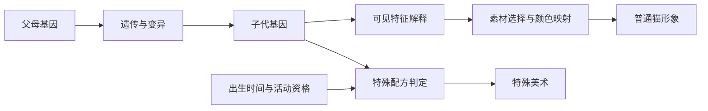
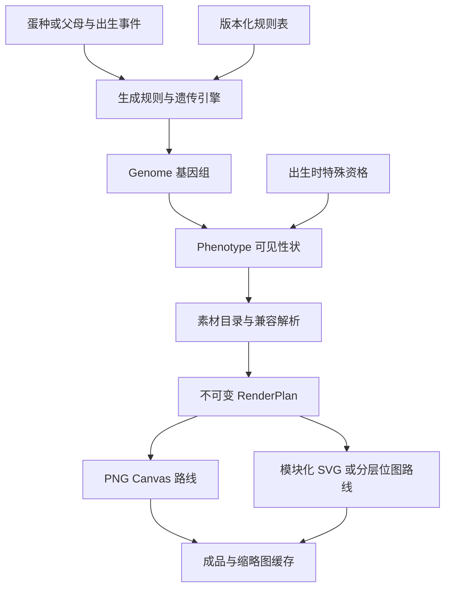

# 以太猫形象生成全链路：规则拆解、QMonsterCreator 对照与两条落地路线

日期：2026-09-15。项目基线：`QMonsterCreator v0.10.0`，Git `20512a2`。本报告为研究与方案评估，未修改运行代码或素材。

后续量级核查：项目在 `d601e40` 已扩展到 11 种异变、44 张 PNG、5,184 个规格组合；以太猫官方页面可核查到 31 种 Fur。详见[最新性状与体型数量对照](/C:/Project/QMonsterCreator/docs/research/2026-09-15-cryptokitties-trait-scale.md)。下文保留原基线分析，864 与 39 等数字不代表更新后的项目库存。

## 1. 结论先行

**建议保留现有渲染、资源校验和存档基础，先补齐规则与形象之间的分层，再用小规模美术试验决定是否重做素材体系。**

当前最主要的限制是：猫咪的体型、毛色、花纹、眼睛和嘴部大量烘焙在完整主体图里；可独立变化的维度主要集中在附加异变。这能稳定交付精致的单只猫，但持续增加脸型、眼型、配色和姿态时，素材成本会快速上升。

值得借鉴以太猫的五项机制：

1. **基因与显示结果分开保存。** 同样外观可以有不同遗传潜力。
2. **轮廓、花纹、颜色、五官分成有意义的维度。** 增加一个维度，可以复用已有内容。
3. **遗传、变异和特殊美术分别建规则。** 随机长角、遗传出新性状、活动专属皮肤是不同事件。
4. **对容易组合的部分进行参数化，对难组合的部分保留预制变体。** 不要求所有素材完全独立。
5. **把形象视为已出生个体的稳定身份。** 后续内容扩展不应无声改变旧猫。

两条路线的选择：

| 路线 | 核心做法 | 最适合的目标 | 主要代价 |
| --- | --- | --- | --- |
| A：渐进升级 | 保留毛绒画风、完整主体与 PNG/Canvas；增加规则层、有限独立配色和预制表情族 | 尽快扩展现有孵化器，保持当前观感 | 大规模脸型、体型和配色扩展仍受素材乘法成本约束 |
| B：重新设计素材体系 | 重建可组合的体型、花纹、五官和颜色通道；复用现有工程分包与存档经验 | 长期繁殖、收藏、多主题持续生产 | 前期美术标准与制作工具投入大，原有 PNG 复用比例低 |

**推荐顺序：先做两条路线共用的规则与版本基础；A、B 各做一个小样；用视觉质量、合格素材生产时间和新增维度成本决定主路线。** 本报告中的数量、权重和排期示例均为评估建议，尚非已确认的产品规则。

## 2. 证据范围与可信度

### 2.1 以太猫资料分级

| 证据类别 | 本报告如何使用 | 边界 |
| --- | --- | --- |
| 官方指南 | 基因结构、遗传概率、特征类别、变异、Fancy、Purrstige、历史美术保留政策 | 多篇为 2018–2019 年时期的说明；描述经典以太坊版设计，不推定为 2026 年运营状态 |
| 官方页面图像 | 观察线条、色块、轮廓和特征表现 | 视觉观察与设计判断明确分开，不据此虚构内部制作流程 |
| 早期复现作者的文章及源码 | 核实 SVG 拆分、体型与花纹预制组合、眼嘴叠加和换色的可行方式 | 属于社区复现，不能称为官方完整渲染源码，也不代表全部后续特征 |
| 本项目实际源码与目录 | 判定当前支持与不支持的功能 | 以现行四个 packages 和工作台为准 |
| 本轮测试与既有 QA 记录 | 区分本轮通过的检查、历史像素验证和人工美术验收 | 不把测试通过等同于所有组合看起来都自然 |

本次使用 agent-reach 的网页阅读及 GitHub CLI 路径。其 Exa 服务未配置，搜索由可用的网页检索补充。未获得官方完整基因到美术的生产代码、内部素材规范、全部映射表或精确制作成本，因此不会将推导方案写成官方实现。

### 2.2 项目核查结果

| 项目 | 本轮结果 |
| --- | --- |
| 当前选择空间 | 6 花纹 × 3 表情 × 3 额顶 × 2 耳 × 2 颈 × 2 背 × 2 尾 = 864 |
| PNG 文件 | 39 张，全部声明为 1254×1254、带 alpha |
| 文件组成 | 18 张完整主体；18 张按花纹适配的耳、鬃毛、尾；3 张通用角/翅膀 |
| 文件总字节 | 50,480,788 字节，约 48.14 MiB；这不是每只猫的下载量 |
| 当前目录 review 字段 | 39 项均为 `pending`；模板也为 `pending` |
| 原有基线 | 864 条规格，864 个不同的 RGBA 哈希；是既有基线文件的统计 |
| 本轮执行 | `npm test`：83/83 通过；`npm run typecheck`：通过 |
| 历史 QA | 2026-09-15 迁移记录报告 864 组合迁移前后像素一致、39 素材哈希保留 |

`pending` 不能直接解释为“用户从未批准过这些美术”：仓库另外保留了原始批准及其范围。准确结论是，**当前运行目录没有将这些历史证据统一落实为可机器判定的正式美术发布状态**。目录审计检查引用覆盖，不检查所有资源必须 approved。

依据：[生成器](/C:/Project/QMonsterCreator/packages/generator-core/src/feline-combination.ts:5)、[资源目录](/C:/Project/QMonsterCreator/packages/asset-catalog/catalog/v0.10.0/catalog.json)、[目录审计](/C:/Project/QMonsterCreator/packages/asset-catalog/src/feline-combination-catalog.ts:101)、[迁移记录](/C:/Project/QMonsterCreator/docs/qa/root-migration-verification.json)、[像素基线](/C:/Project/QMonsterCreator/docs/releases/v0.10.0/render-baseline.json)。

## 3. 以太猫的生成规则到底是什么

### 3.1 先区分三个对象



这是对公开机制的概念整理，不是官方模块图。

- **基因型**：个体携带的遗传信息，包含未显示的性状。
- **表现型**：基因在当前规则下显示成哪些外观特征。
- **美术结果**：具体线条、图层、颜色及特殊形象。

官方定义每只猫有 12 类特征、每类 4 个基因，共 48 个 5-bit 基因，DNA 用 256-bit 数表示。可直接计算出这些基因占 240 bit；不能由此推断剩余位的全部业务用途。并非每个主位基因都会产生可见特征。来源：[Technical Glossary](https://guide.cryptokitties.co/guide/glossary/technical-glossary)。

**对项目的启发：完整 selections 是已选外观；seed 是生成输入。两者都不能自动等同于基因组。** 当前 spec 不含父母或隐性基因。仅给七个槽位改名叫“基因”，不会产生遗传系统。

### 3.2 外观维度的拆法

官方资料列出的常规外观包括 fur、pattern、mouth、eye shape、eye colour，以及三种毛色角色；另有 wild element、environment、Purrstige 相关类别与未公开表达的类别。下表按用途分组，不推断其二进制排列顺序。来源：[Technical Glossary](https://guide.cryptokitties.co/guide/glossary/technical-glossary)、[Fancy Cats 的特征说明](https://guide.cryptokitties.co/guide/types-of-cats/fancy-cats)。

| 维度 | 对画面的作用 | 关键价值 | 本项目对应 |
| --- | --- | --- | --- |
| Fur | 毛型与身体轮廓表现 | 改变整只猫的第一眼印象 | 固定坐姿，缺少独立轮廓选项 |
| Pattern | 斑纹及颜色区域的分布 | 同色可有不同图案 | coat 包含花纹，但也绑定了颜色 |
| Base / highlight / accent colour | 不同语义区域的颜色 | 同一形状和图案能复用多套配色 | 毛色已烘焙在完整 PNG 中 |
| Eye shape | 眼睛形状及神态 | 提高脸部辨识度 | 没有独立眼型槽位 |
| Eye colour | 虹膜颜色 | 较低几何成本的差异 | 没有独立眼色槽位 |
| Mouth | 嘴部形态 | 与眼型组合形成神态 | 3 个完整主体表情，不能独立配眼 |
| Wild element | 特殊附加造型 | 大幅改变轮廓 | 额顶、耳、颈、背、尾五处已可共存 |
| Environment | 环境表现 | 扩展主题和展示情境 | 当前浅/深/棋盘背景只是预览工具 |
| Purrstige 相关类别 | 参与特殊特征配方 | 让基因组合与限时内容相连 | 无对应配方层 |
| Secret 类别 | 当时官方资料未说明可见用途 | 不能当作已落地的外观槽位 | 无需照抄一个没有明确用途的字段 |

**语义维度独立，不代表素材文件也必须完全独立。** 比如花纹可以是独立遗传性状，但需要为不同体型制作不同图案版本。真正要独立的是“玩家得到什么特征”与“程序使用哪个绘制资源”。

### 3.3 显性、隐性与遗传概率

每个类别有一个主位 P 和三个隐位 H1/H2/H3。普通猫的外观主要由主位决定，隐位影响后代。官方指南给出的单个父母基因成为子代主位的近似贡献如下；这是普通遗传概率的说明，发生适配变异时不能直接套用整张表。来源：[Genes](https://guide.cryptokitties.co/guide/cat-features/genes)。

| 来源位置 | 父方贡献 | 母方贡献 |
| --- | ---: | ---: |
| P | 37.5% | 37.5% |
| H1 | 约 9.4% | 约 9.4% |
| H2 | 约 2.3% | 约 2.3% |
| H3 | 约 0.8% | 约 0.8% |

不要把“主位 75%”理解为父母各有 75% 的最终遗传概率：两侧合起来的主位贡献约为 75%。也不要只实现对子代主位的加权抽签，就宣称复刻了整套算法；子代的三个隐位如何排列与保留同样需要定义。

以本项目为例：两只外观相同的虎斑猫，如果其中一只携带豹点隐性性状，另一只四个位置全是虎斑，它们的繁殖价值和结果分布就可以不同。这个例子是建议玩法，不是当前实现。

### 3.4 变异是基因组合事件

以太猫的变异由特定伙伴基因配对触发；新基因能继续遗传，并有多阶进化关系。官方例子中，双方各以 75% 概率提供所需基因，遇到后以 25% 概率变异，总概率为 `0.75 × 0.75 × 0.25 = 14.0625%`。并不是所有繁殖统一 25% 变异；更高阶变异的条件概率也不同。来源：[Mutations](https://guide.cryptokitties.co/guide/cat-features/mutations)。

| 问题 | 以太猫机制 | 本项目现状 |
| --- | --- | --- |
| 变异从哪里来 | 父母的特定基因组合及随机事件 | 从已定义的六种附加造型中选择 |
| 是否要求父母 | 要求繁殖上下文 | 不要求，输入 seed 即可 |
| 是否能传给后代 | 新基因可继续参与遗传 | 没有遗传数据模型 |
| 高阶解锁 | 有变异层级 | 无层级和解锁图 |
| 外观是不是动态创造 | 表达已定义特征 | 使用已制作 PNG |

**程序组合出的“新个体”与生成一张从未制作过的新美术，是两种能力。** 以太猫公开规则不足以支持“每次变异用 AI 即时创造新部件”的说法。本项目未来也应让运行时选用验收过的资源，AI 用于离线辅助生产。

### 3.5 普通猫、Fancy、Purrstige、Exclusive 的区别

| 类型 | 公开机制 | 可借鉴的产品结构 |
| --- | --- | --- |
| 普通猫 | 用可见特征组合形象 | 常规内容长尾 |
| Fancy | 满足特征配方及相应限量/时间条件，采用专属美术 | 为难以模块化的主题保留完整主题猫 |
| Purrstige | 可见及隐藏基因参与限时特征配方 | 基因组合解锁特殊特征 |
| Exclusive | 官方特别引入的专属形象；专属美术不改变底层基因的遗传效果 | 活动赠送、里程碑、人工定制形象 |

来源：[Fancy Cats](https://guide.cryptokitties.co/guide/types-of-cats/fancy-cats)、[Purrstige Traits](https://guide.cryptokitties.co/guide/types-of-cats/purrstige-traits)、[Exclusive Cats](https://guide.cryptokitties.co/guide/types-of-cats/exclusive-cats)。

对 QMonster 的建议：如果将来做“海神猫”之类主题整图，用 `specialAppearance` 表达覆盖关系，底层基因继续独立存在。不要把特定主题整图强拆为十几个必须适配所有猫的部件。特殊资格应在出生时判定并存下；不能在恢复旧猫时根据当前日期重新判定。

### 3.6 稀有度与形象复杂程度分开

从前述公开规则可以推导：一个性状在群体里有多罕见，同时受初始供给、父母基因分布、变异链和特殊资格影响。它不会简单等于“挂件越多越稀有”。隐性基因又使当前看起来普通的猫可能具有不同的育种价值。

QMonster 可分别定义三种指标：

- **出生概率**：某蛋种或配对下出现某性状的条件概率。
- **群体稀缺程度**：已经出生的个体中实际有多少携带/显示该性状。
- **视觉复杂度**：同时出现多少显著器官、颜色和装饰，主要用于控制画面拥挤。

这三项不应共用一个 rarity 数字。比如想提高某主题稀有度，可以改变该主题的出生资格或性状权重，同时保持画面简洁；也可以有容易获得但外观复杂的展示猫。若给异变数量设上限，应明确其是生产分布或兼容规则，而不是修改基因结果后的临时美术补救。

## 4. 以太猫的美术与渲染：能确认什么，不能确认什么

### 4.1 画风如何帮助组合

实际查看官方特征页，可以观察到清晰外轮廓、较大色块、概括性的阴影，以及明显的眼嘴形状。与本项目的细密毛绒、玻璃质感眼睛和柔和体积光相比，它的形状接缝和颜色语义更容易被约束。图像来源：[官方特征页](https://guide.cryptokitties.co/guide/cat-features/cattributes)。

以下是视觉与工程判断：

- 线稿中的一个色块可以承载统一颜色角色；毛绒图中的同一片毛包含底色、阴影、反光和透明毛边。
- 线稿可以预先规定眼睛、嘴巴周围的留白；毛绒脸部需要让毛流、眼窝和口鼻体积连续。
- 清晰线条便于定义相接边界；毛绒边缘需要考虑半透明、背光和遮挡。
- 小尺寸收藏卡需要可辨识轮廓和脸部变化；细毛数量不能直接换算为形象差异。

所以，应先定义允许组合的造型语法，再选择 SVG、PNG 或混合方式。文件格式不是多样性的来源。

### 4.2 一个可核查的早期 SVG 复现

早期复现作者从猫的 SVG 中提取构成元素。现存源码按 `body-pattern` 取主体，分别取 mouth 和 eye，再按颜色角色替换颜色。其目录有 8 体型 × 6 花纹的 48 个主体 SVG，当前源码另有 8 眼型、9 嘴型；这是该历史复现的内容范围，不是以太猫官方完整库存。依据：[作者研究文章](https://medium.com/hackernoon/hacking-the-cryptokitties-genome-1cb3e7dddab3)、[复现组件源码](https://github.com/achadha235/cryptokitty-designer/blob/master/src/components/Cryptokitty.tsx)、[资源加载源码](https://github.com/achadha235/cryptokitty-designer/blob/master/src/components/Genes.ts)。

可抽象为：

```text
主体几何 = bodyPatternVariants[体型][花纹]
五官几何 = eyeVariants[眼型] + mouthVariants[嘴型]
颜色 = 基础色 / 花纹色 / 辅助色 / 眼色的语义映射
图像 = 按固定关系合成
```

这个例子证明了一个重要的中间方案：**允许“体型 × 花纹”耦合，同时把眼睛、嘴巴、颜色独立出去。** 其用字符串替换颜色的老式做法不建议原样搬到新工程；新资源应有明确的颜色通道与材质语义。

作者还观察到某些花纹不显示第三颜色。因此不同基因不一定产生不同画面。对应到本项目，组合数需要同时统计“合法规格数”“不同图像数”和“人能明显分辨的形象数”。来源：[作者研究文章](https://medium.com/hackernoon/hacking-the-cryptokitties-genome-1cb3e7dddab3)。

### 4.3 链上身份与图片并非同一层

官方说明 Fancy 与普通猫的差异可以存在于网站上的美术，而无需修改智能合约。官方还曾对错误发布的美术保留已出生猫的旧样式。来源：[Fancy Cats](https://guide.cryptokitties.co/guide/types-of-cats/fancy-cats)、[Art Variations](https://guide.cryptokitties.co/guide/tips/art-variations)。

对项目最有用的是保存与回放原则：记录当时选择的特征、特殊资格、素材版本和渲染版本；后续版本继续提供旧资源或保存最终成品。是否使用区块链不影响这一基本设计。本项目已通过完整 spec、目录哈希和 runtimeRevision 实现了其中相当一部分。

## 5. 项目现状逐项对照

| 环节 | 当前实际能力 | 与参考机制的差异 | 建议 |
| --- | --- | --- | --- |
| 个体生成 | seed 驱动七槽独立抽样 | 没有父母、基因组、代际 | 增加业务生成规则层，保留现行编辑器 |
| 表现型 | selections 直接记录视觉选择 | 遗传信息与视觉选择未分层 | 定义 Genome → Phenotype → RenderPlan |
| 基础轮廓 | 一套坐姿模板 | 大轮廓多样性少 | 把体型作为中长期优先维度 |
| 花纹与毛色 | 六套预制毛色花纹组合 | 颜色与花纹不可独立复用 | A 做有限合法配色包；B 做语义颜色通道 |
| 五官 | 三种嘴部差异已烘焙成完整主体 | 眼型、眼色不可独立组合 | 先用完整脸部家族或眼色遮罩验证 |
| 异变 | 六种造型，五个位置；同位互斥 | 外观插槽并非遗传变异 | 明确命名；另定义变异配方和记录 |
| 组合合法性 | 枚举与同位置冲突校验 | 无跨部位遮挡、配色、体型约束表达 | 增加 compatibility 数据与确定性解析 |
| 稀有度 | 各选项均匀抽样，注释声明是预览分布 | 无生产掉落或出生分布 | 用独立、版本化的规则表 |
| 遗传 | 无 | 无主隐位、纯种和可预测配对 | 如启用繁殖，单独实现完整遗传模型 |
| 特殊形象 | 无 | 无 Fancy 式整图覆盖和资格记录 | 增加独立特殊形象解析分支 |
| 渲染 | Canvas，多表面、透明裁切、固定定位 | 以硬编码模板适配现有坐姿 | 将新模板几何和层级声明化 |
| 美术管线 | 固定母版、整表情、透明 PNG、来源追踪 | 有生产经验，缺少可量产的独立通道规范 | 把经验转为可校验资产契约 |
| 保存与回放 | SDK 绑定完整 spec、目录哈希、运行版本 | 只支持当前及一个已验证前快照 | 建多版本注册表，冻结历史运行时 |
| 图片分发 | 校验 SHA-256、PNG、alpha 标识和尺寸 | 没有应用层共享解码缓存；逐资源加载 | 按资源哈希缓存并限制并发/内存 |
| 测试 | 83 项规则/目录/渲染测试，另有历史集成与像素 QA | 缺少生产分布、繁殖、感知差异验收 | 按新增能力补针对性测试与人工图集 |

主要代码依据：[生成器](/C:/Project/QMonsterCreator/packages/generator-core/src/feline-combination.ts)、[目录与 RenderPlan](/C:/Project/QMonsterCreator/packages/asset-catalog/src/feline-combination-catalog.ts)、[共享渲染器](/C:/Project/QMonsterCreator/packages/renderer-canvas/src/feline-combination-render.ts)、[孵化适配器](/C:/Project/QMonsterCreator/packages/incubator-adapter/src/feline-hatchery.ts)。

### 5.1 七个逻辑槽位，不等于七张可替换贴图

当前素材选择为：

```text
body = bodies[coat][expression]
mutation = mutations[coat][mutationId]
```

主体包含完整脸和身体；耳与尾的原器官被移除后再替换，颈部鬃毛、尾根等通过主体遮挡。渲染器将若干部件绘制到背后表面，再合入主体，并为不同毛色的部件应用手工定位修正。

这是有意解决毛绒拼接问题的方案。不能因为看到了 clear、遮挡和配准就判定它是错误实现；它的限制是扩展新体型时，现有固定移除区域、根部位置和配准值未必还能复用。依据：[渲染几何与清除操作](/C:/Project/QMonsterCreator/packages/renderer-canvas/src/feline-combination-render.ts:21)、[部件分面合成](/C:/Project/QMonsterCreator/packages/renderer-canvas/src/feline-combination-render.ts:184)、[定位表](/C:/Project/QMonsterCreator/packages/renderer-canvas/src/feline-combination-registration.json)。

### 5.2 素材扩展成本可以直接计算

在保持现有内容结构的前提下，设花纹数为 C、完整表情数为 E：

```text
素材数量 = C×E + C×3 + 3
             主体   耳鬃尾   通用角翼
当前 = 6×3 + 6×3 + 3 = 39
```

| 内容扩展 | 相对当前新增素材 | 额外工作 |
| --- | ---: | --- |
| 新增一个花纹 | 6 张 | 3 主体 + 耳/鬃/尾，另做投影、配准与组合验收 |
| 新增一个完整表情 | 6 张 | 每种花纹一张主体，检查已有器官替换仍匹配 |
| 花纹从 6 增到 12 | 36 张，合计 75 | 通用部件仍可共用的假设下 |
| 为全部现有主体增加 4 种眼型，并继续烘焙整图 | 主体从 18 增至 72，净增 54 张 | 尚未计入眼色、体型、毛长 |

这些是当前结构的算术投影，不是新增素材已经做完的数量。即便同样增加 54 张，新增眼型的识别价值也可能大于更多相近花纹；应按玩家在实际缩略图上的辨识效果评估。

### 5.3 默认随机分布的真实含义

在把各槽位视为理想独立均匀抽样的模型下，48 种异变组合等概率。按有异变的部位数分类：

| 异变部位数 | 48 种中的组合数 | 概率 |
| --- | ---: | ---: |
| 0 | 1 | 2.08% |
| 1 | 6 | 12.50% |
| 2 | 14 | 29.17% |
| 3 | 16 | 33.33% |
| 4 | 9 | 18.75% |
| 5 | 2 | 4.17% |

平均部位数为 `2/3 + 4×1/2 = 2.667`；三处及以上占 56.25%。该推导与现有 864 规格的计数一致，但没有声称任意用户 seed 数据集一定精确服从该分布。

工作台首次默认猫显式指定了五处 `none`，看起来是普通猫；SDK `hatch(seed)` 没有这一覆盖，未指定字段会参加随机。因此“首页是普通猫”不能证明“业务默认主要出普通猫”。依据：[首次状态](/C:/Project/QMonsterCreator/apps/creator-web/src/main.tsx:35)、[抽样函数](/C:/Project/QMonsterCreator/packages/generator-core/src/feline-combination.ts:80)、[SDK hatch](/C:/Project/QMonsterCreator/packages/incubator-adapter/src/feline-hatchery.ts:65)。

建议生产端先抽异变数量/类别，再选兼容位置和具体形态。例如 `0/1/2/3+ = 60/30/9/1%` 可作为待验证的产品草案，不能直接覆盖当前预览算法。数量分布、具体性状稀有度、蛋种偏向必须分别配置。

### 5.4 “独一无二”需要定义口径

项目可以有无数不同 seed，但当前只有 864 个 selections。既有基线确实有 864 个不同像素哈希；它不证明 864 个都能被玩家轻松分辨。

在 864 个等概率结果、独立有放回抽取的假设下，约 35 次生成就达到约一半概率遇到至少一次重复。生成 1,000 次，预期不同外观约为 `864×[1−(863/864)^1000]≈593`。这说明长线收藏需要明确允许同外观不同身份，或继续扩展可辨识空间。

建议分别记录：

- `creatureId`：业务个体唯一标识。
- `genomeHash`：遗传身份，允许同外观不同基因。
- `appearanceHash`：仅由最终可见选择及特殊形象标识决定。
- `renderCacheKey`：外观哈希 + 资源/渲染版本 + 尺寸/格式。

当前缓存键使用完整 spec，包含 seed、rolls、locks；视觉相同但编辑历史不同的对象会产生不同缓存键。当前行为保证区分完整状态，未来大规模分发可将“编辑会话身份”与“成品图缓存”分开。依据：[现有缓存键](/C:/Project/QMonsterCreator/packages/incubator-adapter/src/feline-hatchery.ts:60)。

### 5.5 历史设计文档与现行实现要分开

2026-08-21 设计稿中的 14 槽、主题池、risk、稀有度联动等是早期设计内容。现行正式入口为七槽猫型实现，当前接入文档也明确未引入蛋种主题、risk 或 mutationBonus 映射。不能把早期文档列出的能力算作已经交付。依据：[历史设计稿](/C:/Project/QMonsterCreator/docs/superpowers/specs/2026-08-21-qmonster-creator-design.md)、[当前接入指南](/C:/Project/QMonsterCreator/docs/integration/qmonster-hatchery-integration.md)。

## 6. 两条路线共用的工程基础

### 6.1 建议的数据流



现有 `generator-core → asset-catalog → renderer-canvas → incubator-adapter` 分包方向可以继续保留。建议新增能力落入现有职责内，不必为了结构图先拆出大量新包。

| 模块 | 建议新增内容 | 可复用内容 |
| --- | --- | --- |
| generator-core | 基因组、生成/遗传规则版本、性状解释、事件记录 | 纯 TS、严格解析、确定性子流思路 |
| asset-catalog | 特征定义与资源投影分离、体型兼容、颜色通道、图层约束 | 资源 ID、SHA-256、来源与覆盖审计 |
| renderer-canvas | 模板注册表、材质通道与新绘制指令 | 隔离画布、失败清空、统一输出、资源释放 |
| incubator-adapter | 新旧版本路由、特殊资格持久化、图像缓存身份 | hatch/restore、精确快照和导出封装 |
| creator-web | 特征编辑、配对预览、来源解释、兼容性诊断 | 锁定/重抽/手选、导入导出、异步结果保护 |

建议的对象职责如下，字段名仅为草案：

```text
CreatureRecord
  creatureId / parentIds / birthEventId
  genomeSchemaVersion / geneticsRulesVersion
  genome: 每类性状的主位和隐位
  birthEvents: 发生的变异、特殊资格与规则来源
  phenotypeSchemaVersion / phenotypeRulesVersion
  phenotype: 实际显示的特征与 specialAppearanceId
  visualSnapshot: catalogDigest / rendererRevision / templateId

EditorSession
  previewSeed / rerollCounters / locks / manualOverrides
```

需要明确三条边界：

1. **编辑器能手选，不意味着已出生个体允许任意改基因。** 预览、编辑、正式出生是不同命令。
2. **存储可读 JSON 即可。** 除非确有二进制协议需求，不必模仿 256-bit 编码来增加维护成本。
3. **每个结果应能解释来源。** 比如“眼型来自父方 H1”“本次触发某变异配方”“某配色由主题约束选中”。

### 6.2 抽样、遗传与兼容约束的顺序

普通孵化建议流程：

1. 根据版本化蛋种规则确定可用性状池。
2. 抽取基础轮廓、花纹和合法配色组。
3. 抽取异变数量及部位，再选择具体形态。
4. 解析形态组合的兼容变体与前后层关系。
5. 校验该表现型存在完整可发布素材；记录结果及规则版本。

若后续引入繁殖，必须另外定义：父母可繁殖条件、主隐位混合顺序、变异发生阶段、子代隐位保留方式、可跨代遗传的字段，以及随机来源。上文的概率表适合解释结果，不能替代完整算法规格。

**不要在发现图片不好拼时静默重抽子代基因。** 这会改变实际遗传概率，也使玩家的配对计算失真。优先为合法基因组合提供兼容素材投影；若确实存在业务禁配，需要在规则层明确、可解释地处理，并纳入概率计算。

前端 seed 适合可重复预览。正式稀有出生若需要防止玩家挑 seed，应由业务端产生并保存权威出生事件和随机结果，再把确定的表现型交给 SDK。现有 FNV/PRNG 不承担防作弊随机职责；这是接入边界，不是要求本项目立即搭建完整后端。

### 6.3 版本化与旧猫兼容

当前随机子流包含 `schemaVersion` 和 `catalogVersion`，因此直接更改目录版本字符串可能改变同 seed 的抽样。新方案应把**随机规则版本**与**美术目录版本**分离。已有 spec 保存完整选择，回放时继续按所存结果执行。

建议迁移方式：

- v1 旧猫继续交给冻结的 v1 运行时与资源。
- v2 新猫使用新对象模型，声明自己的规则和美术版本。
- 旧猫默认标记为 legacy，不推断它历史上有怎样的父母和隐性基因。
- 如果产品决定让旧猫参加繁殖，另行批准一套“赋予隐性基因”的一次性规则，保存迁移记录；不能无声把四个位全复制成当前特征而令全部旧猫变成纯种。
- 不要只替换 `0.10.0-candidate.1` 为正式数字；当前该值刻意保留用于兼容。
- 为未来历史版本建立允许列表/运行时注册表；当前 SDK 只识别一个已验证旧快照。

依据：[随机子流](/C:/Project/QMonsterCreator/packages/generator-core/src/feline-combination.ts:81)、[快照识别](/C:/Project/QMonsterCreator/packages/incubator-adapter/src/feline-hatchery.ts:43)、[协议兼容说明](/C:/Project/QMonsterCreator/docs/integration/qmonster-hatchery-integration.md)。

## 7. 路线 A：保留毛绒风格，渐进升级

### 7.1 素材拆分策略

继续把需要连续体积、毛流和表情的区域作为整体制作，仅拆分已经能证明稳定的变量。

| 区域 | 建议做法 | 原因 |
| --- | --- | --- |
| 身体与完整脸 | 暂时保留完整主体，增加少量脸部家族 | 现有独立嘴部拼贴曾失败，不应无证据地回退 |
| 虹膜颜色 | 在专门授权区域内试做遮罩着色，保留瞳孔和高光 | 对轮廓影响小，较容易控制 |
| 毛色 | 少量经过设计的整套配色；新资产预留颜色遮罩 | 任意全图色相偏移会误伤鼻子、口腔、白毛和反光 |
| 耳/尾 | 按模板制作可替换完整器官，根部留足遮挡区 | 已有整尾替换经验可延续 |
| 鬃毛/翅膀/角 | 明确前后部分、根部遮挡和适配体型 | 共用文件与专属文件按真实兼容关系决定 |
| 极端主题形象 | 完整主题猫或局部大套件 | 避免一个神话主题产生全目录适配负担 |

为现有 PNG 自动提取颜色遮罩通常只能近似，不等于拥有无光照的底色。第一轮小样应比较“人工修订遮罩”与“重新制作可换色主体”的时间和效果。不能承诺现有所有毛色都可无损任意换色。

### 7.2 建议的小样范围

使用两种差异大的现有毛色（例如黑白与三花），验证：

- 2 套虹膜颜色。
- 2 套完整表情/神态。
- 无异变、替换耳、替换尾、耳尾同时、角与鬃毛叠加等重点情况。
- 自然毛色与一套幻想配色。

评估重点是局部修改后能否保留毛边、眼睛高光、鼻口颜色和器官自然连接。不要先扩展全部六花纹，再发现管线在最复杂花纹上不可用。

### 7.3 优点与边界

**优点**：现有 39 张 PNG、固定模板、导出 SDK 和美术经验可以继续发挥作用；交付风险相对小；保留用户已接受的视觉方向。

**边界**：

- 新眼型若仍需完整主体，会继续乘以花纹与表情数。
- 多体型会牵涉原耳尾移除区域和附加部件定位，不能只加一个 enum。
- 复杂毛色的配色独立化需要重新制作材质通道或大量修订。
- 加更多附加器官主要扩大“装饰组合”，不一定显著增加猫本身的辨识度。

**停止扩张的信号**：每增加一个核心性状都要批量重画大部分主体；修接缝时间超过新部件制作时间；新增数量很大但缩略图难以区分。出现这些情况时，应把下一轮内容预算转到路线 B 的母版建设。

## 8. 路线 B：重新设计模块化美术体系

### 8.1 两种可行表现方式

| 方案 | 具体做法 | 适合情形 | 注意事项 |
| --- | --- | --- | --- |
| B1：平面或适度体积感的矢量/混合 2D | 清晰轮廓、语义色块、独立五官、体型花纹变体 | 希望以较低边际成本持续增加大量性状 | 需要接受画风调整；SVG 仍须设计兼容，不能自动产生好看组合 |
| B2：保留毛绒的离线 3D 母版出图 | 在统一相机、灯光、模型接口下制作器官及表情，离线输出透明分层图与遮罩 | 必须保留当前材质，又要大幅扩展形体 | 需要模型、材质与技术美术能力；阴影和相互遮挡仍需变体处理 |

两者运行时都可以继续交付 Canvas 合成结果。B2 不要求用户端运行实时 3D；但若未来需要大幅转身、自由视角和复杂动画，需要重新评估实时 3D，而非把它算在本轮静态图方案内。

### 8.2 先设计视觉语法

建议从以下层级开始：

1. **体型家族**：如圆胖、修长、短腿；每类定义头体比例、脸部工作区、器官接口。
2. **花纹家族**：定义图案语义以及在各体型上的合法投影。
3. **颜色角色**：基础色、花纹色、辅助色、眼色；用审核过的色板关系限制组合。
4. **神态家族**：独立眼型和嘴型，但对极端表情提供组合变体。
5. **异变部位**：保留目前多位置共存能力；新增 `requires`、`excludes` 与兼容版本。
6. **特殊形象**：允许整图覆盖，避免破坏普通组合体系。

不要要求“一张通用花纹贴遍所有体型”。体型 × 花纹仍可预制，眼嘴也允许局部配对版本。把兼容成本放在适配表里，比藏进渲染器的一串条件分支更易维护。

### 8.3 资产契约

每项正式素材至少声明：

| 项目 | 需要回答的问题 |
| --- | --- |
| traitId / assetVariantId | 它表达哪个性状？为什么选到这个资源变体？ |
| templateId / poseId | 适用哪种体型和姿态？ |
| 坐标、基准尺寸、锚点 | 如何与母版对齐？允许多少缩放？ |
| 前后层及遮挡区域 | 哪些根部必须在主体后？哪些边缘必须在前？ |
| 颜色/材质通道 | 哪些区域可换色？哪些高光和阴影必须保留？ |
| compatibility | 与哪些眼、嘴、角、耳、鬃毛可组合？ |
| source / hash / approval | 原稿和最终导出是什么？批准覆盖哪个版本？ |

对于替换耳尾，优先从母版直接提供无原器官的主体变体或模板遮罩，不持续追加全局多边形去“擦掉”越来越多不同轮廓。对于前后穿插的部件，拆成后层/前层，而不是依赖单一 zIndex 解决所有遮挡。

### 8.4 一个用于估算的内容规模

假设规划 3 体型 × 6 花纹 × 6 眼型 × 4 嘴型 × 8 套合法配色 × 4 眼色 × 48 异变组合，理论规格空间为 **663,552**。

若体型与花纹预制，需要 18 套主体几何；眼睛、嘴巴和颜色可以复用的部分不必乘入主体文件数。**但不能据此宣称只需几十张资源就已完成六十多万种合格猫**：体型适配、表情兼容、异变变体、遮罩、阴影、前后层和测试都会增加制作量。

663,552 也不是最终可辨识形象数：配色限制会减少组合，遮挡可能吞掉差异，相近色板可能难以辨识。最终应从合法渲染空间中统计，结合人工抽查及感知相似度检查。

### 8.5 最小证明样本

在扩展正式库存前，先完成：

- 2 个体型 × 3 个花纹 = 6 套主体投影。
- 2 眼型 × 2 嘴型 × 3 色板。
- 无附加器官和 2 个高风险附加器官，重点验证耳/角、嘴/鬃、尾/身体边界。
- 同一性状在不同体型上仍能被识别；同一母版上的部件能自然对齐。

若这个小范围不能稳定组合，扩大库只会放大返工。通过后再扩展体型与特征，不先做完整基因玩法来掩盖视觉问题。

## 9. 美术生产落地流程

以下流程可用于 A 的新增素材，也可用于 B 的新母版。

1. **定义性状。** 写明它改变的可见区域、轮廓、颜色角色和与其他性状的关系。
2. **锁定母版。** 相机、姿态、光向、头体比例、基准尺寸与器官接口进入版本控制。
3. **制作候选。** AI 基于固定参考辅助局部改绘；关键接缝、遮罩与分层由人工或受控 3D 管线修订。
4. **导出层与元数据。** 颜色区域、根部遮挡、透明边缘和适配体型一并交付；不能只交一张看起来透明的预览。
5. **机器检查。** 格式、尺寸、字节哈希、alpha、非空区域、引用完整性与模板适用性。
6. **组合检查。** 同时看单部件、成品全身、局部放大，以及深浅背景上的半透明毛边。
7. **绑定批准。** 批准记录绑定实际导出文件、模板、渲染版本及已验证组合范围。
8. **不可变发布。** 正式版本保留原文件；更改任何影响画面的内容都发布新快照。

项目已经沉淀了完整表情、整尾替换、避免重复器官、真实 alpha 和独立美术验收等经验，应保留为管线约束。依据：[现有美术规范](/C:/Project/QMonsterCreator/docs/art/feline-composition-guidelines.md)。

## 10. 成本、实施阶段与决策点

### 10.1 工作量结构对比

以下是方案级相对估计，不是排期承诺。项目没有提供团队产能、素材单件合格率或目标设备数据，因此用可计数的工作包优先于给出伪精确的人日。

| 工作项 | 路线 A | 路线 B |
| --- | --- | --- |
| 规则/表现型分层 | 中，两者共用 | 中，两者共用 |
| 基因与繁殖（若正式启用） | 中到高，独立于画风 | 中到高，独立于画风 |
| 现有 39 PNG 的直接使用 | 高 | B1 低；B2 通常作为参考和 legacy 内容 |
| 现有工程基础复用 | 高 | 高，渲染指令与模板部分需扩展 |
| 新模板与技术美术投入 | 低到中 | 高 |
| 新增颜色的边际成本 | 中，取决于遮罩质量 | 低到中，取决于色板与材质规范 |
| 新增眼型/嘴型 | 可能乘以花纹数 | 主要增加部件与局部适配 |
| 新增体型 | 高，现有几何依赖需重新验证 | 中到高，接口仍需适配 |
| 大规模内容验收 | 组合数扩大后仍需投入 | 更多依赖覆盖策略和自动图集 |
| 主要失败风险 | 素材越来越多，核心形象仍相似 | 母版开发时间长、画风不被接受 |

实际估算建议使用：

```text
美术投入 ≈ 母版建立时间
         + 新资源数 × 单件制作时间 / 首轮合格率
         + 跨体型适配数 × 单次适配时间
         + 组合验收与返工时间
```

先用小样记录这些参数，再形成可用排期。代码新增行数不能预测美术总工期。

### 10.2 推荐的阶段顺序

| 阶段 | 具体交付 | 完成条件 |
| --- | --- | --- |
| P0：固定基线 | 保留 v1 快照、864 基线；明确当前批准范围；记录同外观重复的产品口径 | 旧猫能够按旧运行时恢复；数据口径一致 |
| P1：共用规则基础 | 版本化出生分布、Phenotype、独立编辑会话、特殊资格记录草案 | 新规则不会改写 v1；生产抽样与预览抽样分离 |
| P2：A/B 小样比较 | A 的毛绒眼色/表情小样；B 的 2 体型模块化小样；生产耗时记录 | 画质、接缝、辨识度、扩展成本有实际证据 |
| P3：选择主美术路线 | 扩展批准的模板与素材目录；形成正式资产契约 | 所有对外可生成表现型都有合格投影 |
| P4：遗传与主题内容 | 完整主隐位规则、变异配方、配对概率、特殊猫出生记录 | 模拟与解析概率一致；无静默重抽基因 |
| P5：规模化交付 | 多版本 SDK、缩略图、缓存、分布监控、内容发布工具 | 目标设备性能达标，历史回放与新版本互不影响 |

P1 可先只保存表现型与规则来源，为遗传预留接口；不要为了名字完整而生成没有玩法意义的隐性数据。正式启用繁殖前仍需确认具体遗传规则和旧猫参与方式。

### 10.3 路线选择标准

- **选择 A 为主**：当前毛绒质感必须保留；近期内容规模有限；主体变体的制作和验收成本可接受。
- **选择 B1 为主**：允许调整视觉表现；核心目标是长期组合、繁殖与可辨识性状收集；愿意先投资设计规范。
- **选择 B2 为主**：毛绒质感与大规模轮廓变化都不可让步；团队能承担受控 3D 母版和技术美术投入。

本次推荐 **A 维持现有交付，B 用小样验证长期价值**。如果 B 的单件生产效率和组合质量更好，新生内容逐步进入 v2；旧猫继续由 v1 服务，无需一次性重画全部历史内容。

## 11. 如何验收，避免“组合数很多但不好看”

### 11.1 四层验收

| 层级 | 应验证的内容 | 合格证据 |
| --- | --- | --- |
| 数据合法 | 无重复槽位、未知性状、越界权重、缺失投影 | 严格 schema 与目录审计 |
| 规则正确 | 同版本可复现；遗传和变异概率正确；限制没有偷偷改分布 | 固定测试向量、针对性统计模拟、事件日志 |
| 渲染正确 | 不重复器官、不缺图；新旧版本回放一致；失败没有半成品 | 像素回归、真实资源加载与导出测试 |
| 美术合格 | 毛流/线条连续、根部自然、脸部协调、缩略图可辨识 | 审核图集与绑定版本的人工批准 |

规模小时可以全组合验收；规模变大后用全量目录覆盖 + 成对覆盖 + 已知高风险三元组合 + 按概率抽样。**成对覆盖不是对全部组合美术质量的数学证明。** 尤其需要单独覆盖角×耳×鬃、尾×体型×花纹、眼×嘴×脸型，以及极浅/极深配色。

### 11.2 建议的小样判定标准

以下作为方案评估的初始目标，由小样结果校准：

- 所有小样均无重复器官、明显接缝、越界裁切与缺图。
- 在实际产品展示尺寸及 128px、256px 对照图中检查核心特征；设计上定位为主要差异的性状应能明确识别。
- 统计“新增一个眼型/花纹/体型，需要修改多少旧资产”，衡量耦合程度。
- 记录每项素材从初稿到合格的工时与返工原因。
- 对相似外观做聚类/人工复核，报告有效辨识度，不只报笛卡尔积。
- 生成功能出现失败时保留诊断；不得用上一只成功猫伪装本次出生成功。

### 11.3 性能需要测什么

当前每张 1254×1254 RGBA 表面的理论数据量约 6 MiB。渲染器使用输出、frame、subject，并在一次渲染期间持有已获取位图；多只并发会叠加内存。当前实现会释放可关闭位图，这是已有优点。

建议测：冷缓存出生耗时、热缓存耗时、列表 20 只的峰值内存、移动端导出、跨域失败、版本资源缺失。尚未进行本轮移动设备或吞吐量实测，不能根据代码声称已有具体性能瓶颈或达标结论。

工程方向：按哈希缓存原始资源；有界复用解码资源并清楚定义释放所有权；合成并发限流；列表使用预生成缩略图；成品缓存不包含无关编辑历史。跨浏览器导出不一定字节完全一致，需要以固定渲染环境、像素基线或已保存的成品图定义视觉承诺。

## 12. 最终判断

**以太猫最值得借鉴的是可持续扩展的性状体系，以及基因、表现型和美术之间的分离。** 它让有限素材能表达更多可解释的差异，也让玩家能通过遗传和配方追求目标。

QMonsterCreator 已经具备可靠的小规模组合与交付基础：完整规格、固定资源、统一渲染、错误处理和历史回放。它当前缺少的主要是低耦合的核心视觉维度，以及生产分布、遗传与特殊形象的规则层。

**第一优先级是让新的性状不再自动意味着重画所有主体；第二优先级是让每次出生有清楚的规则和稳定身份。** 更大组合数应是这两件事做对后的结果。

---

## 附录：检查说明

- 本轮重新执行：83 项测试通过、TypeScript 类型检查通过。
- 本轮读取并统计：当前目录、资源大小、资源 review 状态、864 条基线及其不同像素哈希。
- 本轮视觉查看：现有工作台 QA 截图、以太猫官方特征页图像；未逐张人工重验全部 864 个组合。
- 864 组合迁移前后像素一致、独立构建与旧封装恢复的结论引用现有 QA 记录，本轮没有重新跑这些集成检查。
- 未修改运行代码、配置、快照或美术文件；新增本报告。
- 报告中的新数据模型、概率样例、内容规模与阶段建议均待后续实施决策确认。
